# Signature Classifier

<p align='center'>
  
   
  
</p>


<details open="open">
  <summary>Table of Contents</summary>
  <ol>
    <li><a href="#about">About</a></li>
    <li><a href="#prerequisites">Prerequisites</a></li>
    <li><a href="#quickstart">Quickstart</a></li>
    <li><a href="#details">Details</a></li>
  </ol>
</details>

## About
We created a deep learning model using TensorFlow to classify signatures as forged or genuine. We served the model by creating an api with Flask and deployed an easy to use web interface that allows you to submit an image of a signature and will return a prediction and a confidence level.  

## Prerequisites
In order run and modify our app you need to following tools:
- [Python 3](https://mirror.las.iastate.edu/CRAN/)
- [Docker desktop version](https://docs.docker.com/get-docker/)
- [Github desktop version](https://desktop.github.com/)
- [An account on GitHub](https://github.com/)
- [Flask 2.0.x](https://flask.palletsprojects.com/en/2.0.x/)
- [Microsoft Azure Account](https://azure.microsoft.com/en-us/free/)

## Quickstart
In order to only run the project locally you will only need a GitHub account:
1. The first step is to clone the branch titled "Local" to you machine. This can be done by entering the following command in a CLI.
    ```
    git clone -b Local https://github.com/JasonFreeberg/image-classifier-example.git
    ```

2. Next, you need to download the required packages. Run the following command to make sure all dependencies are installed in your environment.
   ```
   pip install -r backend/image-upload-api/requirements.txt
   ```
3. Now the Flask app is ready to run. To run the Flask app run the following command
   ```
   python backend/image-upload-api/flask-api/main.py
   ```
4. Now you should have a web interface that will allow you to submit images of signatures and return a prediction of whether it is real or fake at the following address!
   ```
   http://127.0.0.1:5000
   ```
   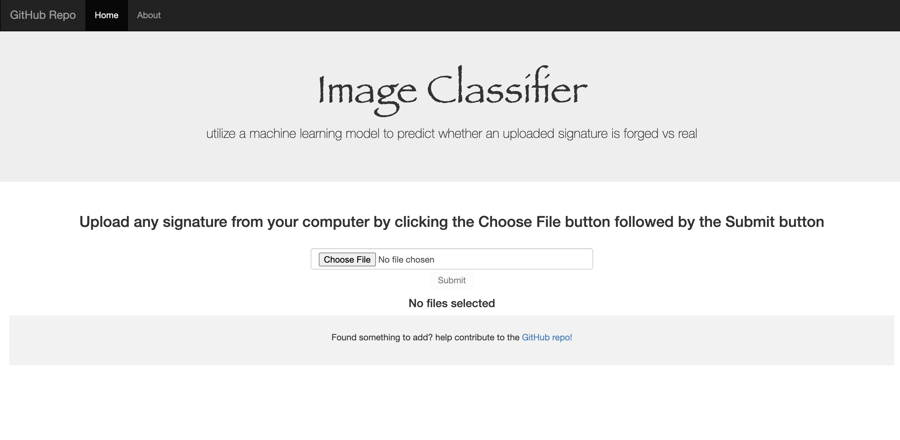

## Details
### The Model

#### Image pre-processing
1. First we researched the different softwares used to process image data (ex.scikit-learn, tensorflow-keras) 
Import the packages for keras from tensorflow
2. Next was writing the file path to access the images in the dataset
3. Convert all images to color (some are black and white)
4. Convert each individual image to a numpy array
5. Append each image and their label (forged/genuine) to their respective lists
6. To create more image data, we used image augmentations (color inversion, change contrast, gamma correction, logarithmic correction, sigmoid correction) *repeat steps 4-5 for each augmentation
7. Convert the lists containing the image data and labels (image_data, labels) to numpy arrays
8. Shuffle the image data and their respective labels randomly
9. (optional) Create a function called drawImg(img) which visualizes the images, and checks that image augmentation was correctly applied

#### Keras Classification
1. Create a Sequential model and research appropriate layers to add (Conv2D, MaxPooling2D, Dropout, Flatten, Dense)
2. Split the image data and their labels into training and testing sets (we used a test size of 0.8)
3. Compile the model, research optimizer, loss and metrics beforehand
4. Fit the model, set epochs (we used 15)
5. Print the test accuracy of the model (we got 0.622)

#### Serialization
1. Create a json string for the model
2. Write the model as a json string to a json file
3. Dump the string to preview, check if it wrote correctly
#### Deserialization
1. Open the json file with read access, print to check if it deserialized correctly

### Backend

### Frontend


### Deployment with Microsoft Azure
We deployed our website to the cloud using Microsoft Azure's app service.
These are the steps you need to follow to deploy the web interface using Azure:
1. Login in to or create an account with Microsoft Azure. 
2. Select "Create a resource" and create a "Web App" 
	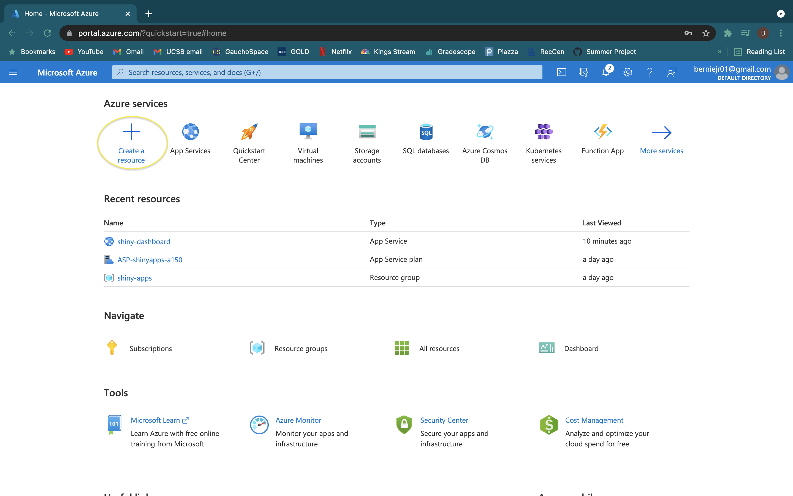
	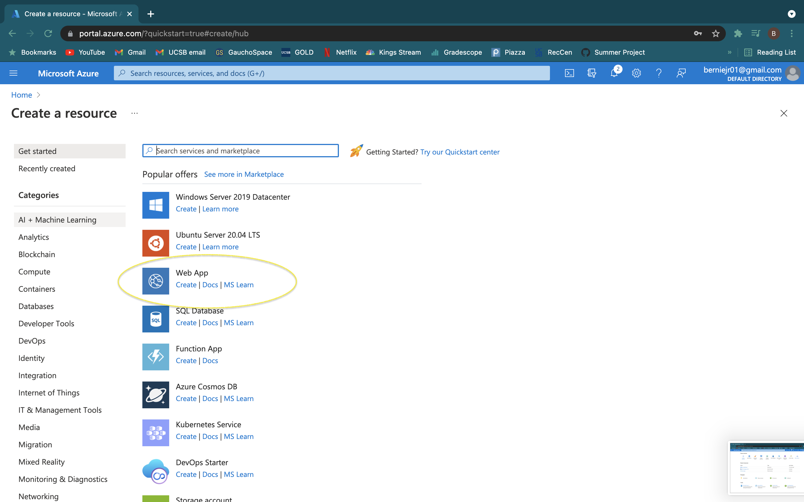
3. Select or create a resource group which acts as a folder for this resource and give the resource a name, this will act as the url.
	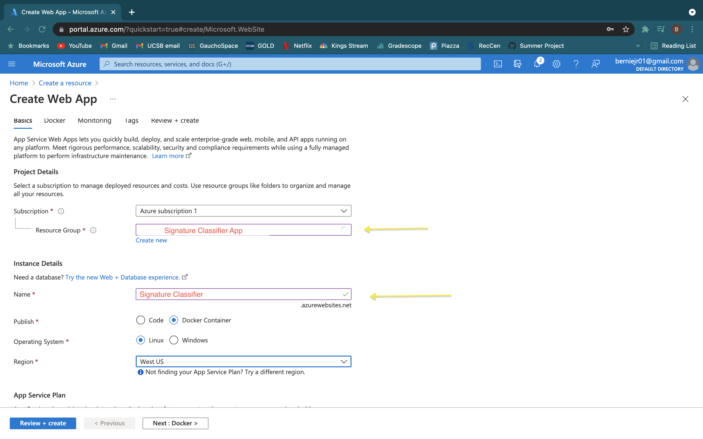
4. Select "Docker Container" and the region you want the server to based in.
	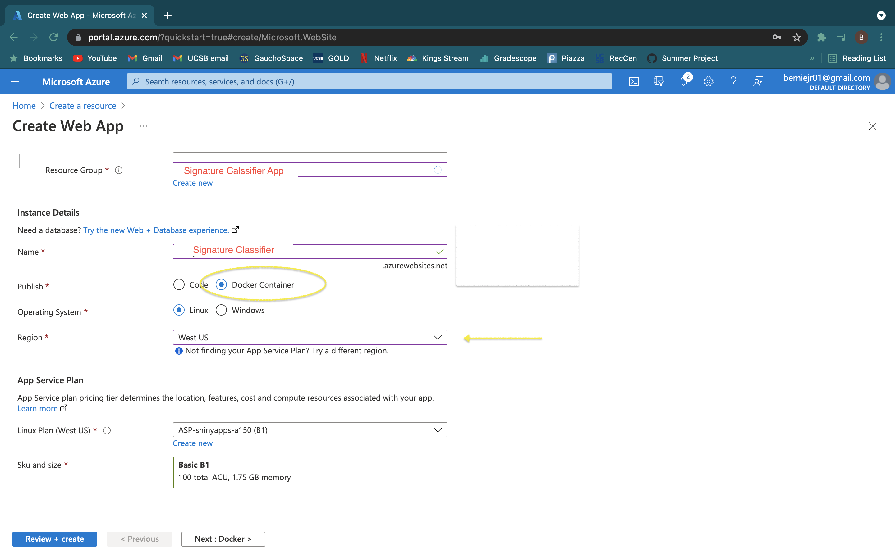
5. Select the App Service Plan and specs you need for the dashboard
	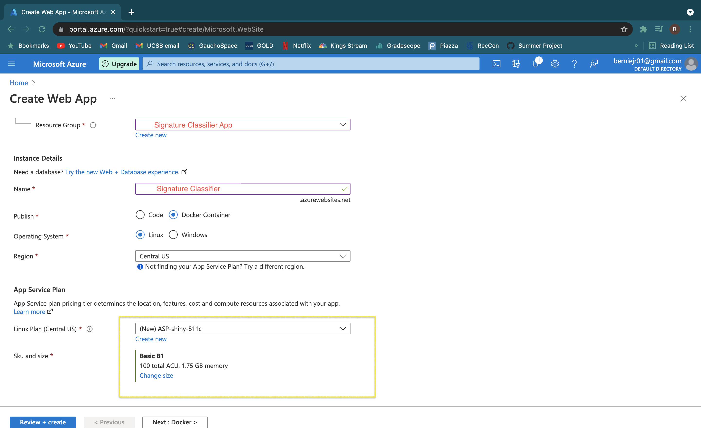
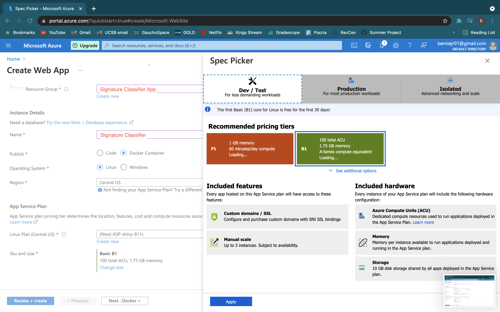
6. Click "Next", then you will need to select the container registry you are using, in this case Docker Hub. Then you need to fill in the name of the image being deployed which is 
  ```berniegraves/signature-classifier:6c88876b83055b8c8324e36f132f69594d53b1cc.```
	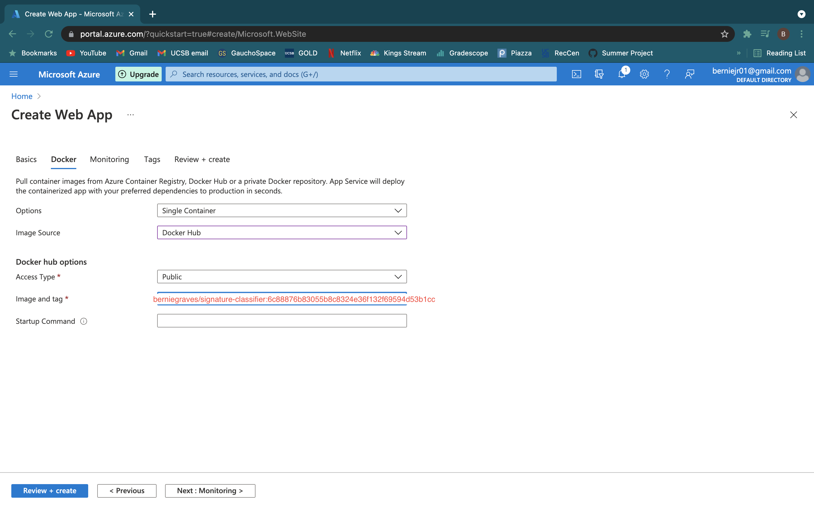
7. Click "Review and Create"
8. Navigate to the resource overview then select "Configuration" on the sidebar.
	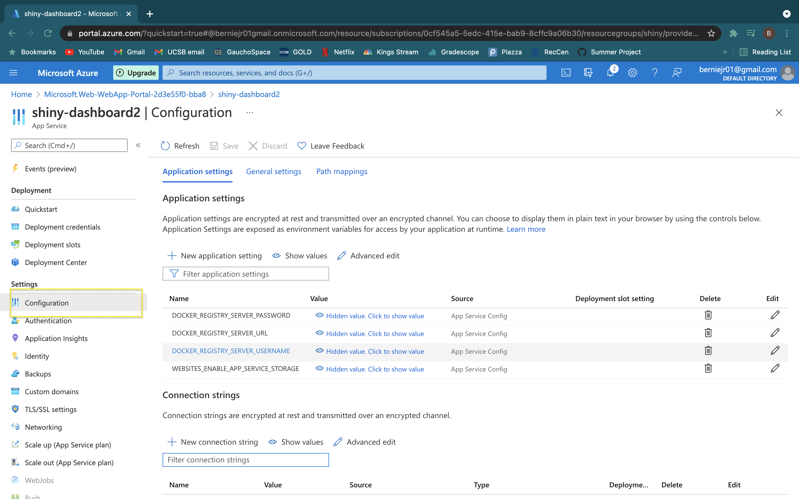
9. Click on "New Application Setting" and type "WEBSITE_PORT" name and "5000" for value, then click save at the top of the page.
	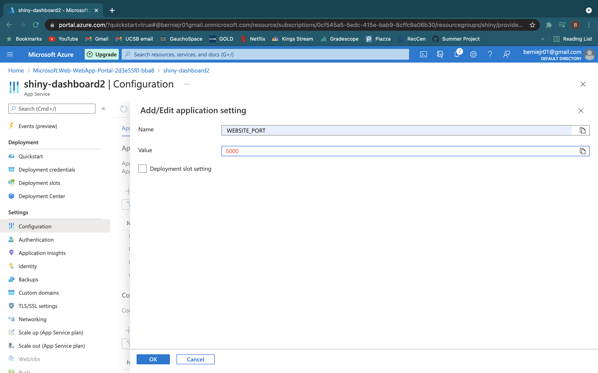

Congrats!! Your web app has been deployed

### Creating GitHub workflow
In order to make CI/CD easier, we made a GitHub Actions workflow to automate deployment on pushed to the main branch. Luckily, Azure makes this easy. Before beginning, if you cloned this repository you need to navigate to the workflows folder and delete `main_shiny-dashboard.yml`.
1. Navigate to the resource overview page a select "Deployment Center"
2. Select "GitHub Actions" and then click "Authorize" to allow Azure to connect to your GitHub account. The Authorize button will be a green button arounf the center of the screen.
3. You might need to refresh after authorizing, but it should look like this. Now you need to fill in the necessary information about the GitHub repository, Your Docker Hub sign in information and image name.
	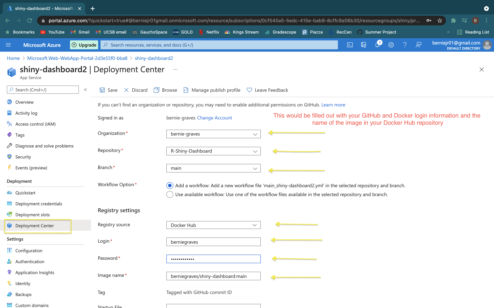
4. Click "save" at the top. This will create a workflow file named "main_shiny-dashboard" in the Github repository.
	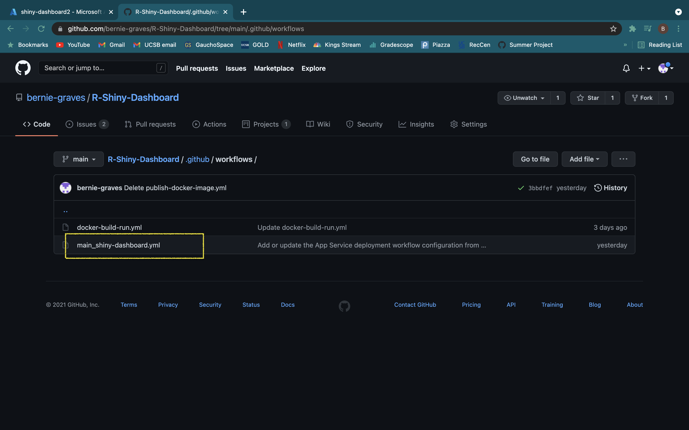
Now the dashboard will update when changes are pushed to the repository. 